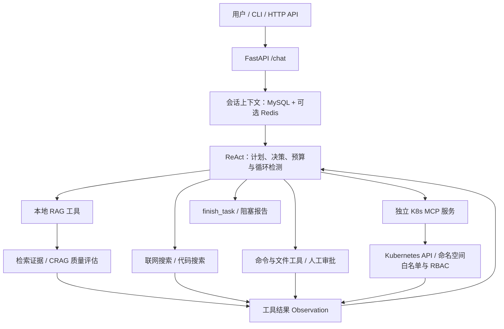

# MEC/5G RAG Agent

面向 MEC/5G 技术文档问答与 Kubernetes Pod 辅助诊断的 Agent 系统。基于 FastAPI、DeepSeek、LangGraph、ChromaDB 和独立 MCP 服务，结合混合检索、受限 ReAct 工具调用以及 MySQL + Redis 会话记忆。

- **领域知识问答**：按章节与 Token 预算切分文档，通过向量 + BM25 双路召回、RRF 融合、邻接窗口扩展和可选 Cross-Encoder 重排，提供可追溯的回答证据。
- **工具执行与辅助诊断**：ReAct 根据任务计划选择工具，程序负责权限、审批与循环保护；独立 K8s MCP 读取 Pod 状态、事件与日志，辅助定位故障。

## 系统架构



`/chat` 当前入口是 `ReActWorkflow`。独立的 `RAGWorkflow` 使用 LangGraph 实现检索、生成与自检流程；ReAct 会复用其中的检索能力，两条路径的能力边界见文末。

### 检索链路

```text
文档解析 → 章节/段落识别 → Token 预算切分 → Embedding → ChromaDB

向量 Top-40 ─┐
             ├→ RRF Top-30 → 同文档邻接窗口 ±1 → 重排 → Top-6 证据
BM25 Top-40 ─┘
```

| 模块 | 当前实现 |
| --- | --- |
| 文档解析 | Markdown、TXT、PDF 文本层、DOCX，保留来源与切分元数据 |
| 切分 | 结合章节、段落与长度预算；默认 112 Token，重叠预算 16 Token |
| 向量模型 | `sentence-transformers/paraphrase-multilingual-MiniLM-L12-v2` |
| 混合召回 | ChromaDB 向量召回 + BM25；通过 RRF 融合检索列表 |
| 证据扩展 | 命中子块与同文档相邻块构成窗口，再进行重排 |
| 重排 | 默认轻量词项/排名评分；可切换 `BAAI/bge-reranker-v2-m3` Cross-Encoder |
| CRAG 风格纠正 | 评估候选证据质量，结合查询改写与有上限的补充检索 |
| Self-RAG 风格自检 | 独立 RAG 工作流中的答案支持性检查与有限重试，不涉及论文中的模型训练 |

### 受限 ReAct 与工具安全

模型生成高层计划并选择工具，程序负责参数校验、权限、审批状态和预算控制。工具结果通过 `assistant(tool_calls) → tool(tool_call_id)` 消息链进入后续决策。

- 默认最多 6 个执行步骤、8 次工具调用，以实际配置为准。预算是上限，不是必须用满的目标。
- 命令标准化、命令/结果指纹和历史记录用于识别重复执行与无进展；命中保护条件时复用结果、触发反思或返回结构化阻塞报告。
- `cmd_execute` 默认关闭，仅支持 Windows `cmd.exe`。只读白名单外的命令须经 `POST /cmd/approve` 明确批准；拒绝或过期不会执行。
- `file_search` / `file_read` 限定根目录；`file_write` / `file_delete` 需要审批，审批关联会话、目标路径和操作内容。
- 任务及待审批状态写入 MySQL，支持单实例重启后的状态恢复；不承诺多副本并发下的严格一次执行。

工作目录限制和命令白名单不是操作系统沙箱。Linux 容器中保持 CMD 关闭，Kubernetes 诊断经 MCP 完成。

### 分层会话记忆

MySQL 保存会话消息、语义摘要、任务摘要、重要事件、任务状态和文件产物记录；Redis 可选，用于摘要与重要事件查询结果缓存，MySQL 仍为持久化数据源。

近期消息提供对话连续性，摘要压缩历史信息，重要事件按相关性、重要性和时间因素检索。文件产物使用结构化记录保留精确路径。缓存读取失败可以回源，但当前仍有写入失败后的旧缓存一致性问题，详见测评报告。

### Kubernetes MCP

主 Agent 经 Streamable HTTP 与独立 MCP 服务通信。`analyze_pod_bug` 接收命名空间和精确 Pod 名称，读取状态、Warning Event、当前日志及前一次容器日志，返回经过基础脱敏的证据。

MCP 使用独立 ServiceAccount，结合命名空间白名单与 Role/RoleBinding。示例 RBAC 仅授予 `pods`、`pods/log`、`events` 的读取权限，不授予 `exec`、修改工作负载或读取 Secret 的权限。当前工具不等同于任意 kubectl 终端，也不是全自动故障修复器。

## 快速开始

建议使用 Python 3.11；MCP 依赖单独安装，也可使用提供的 Dockerfile。依赖包含 PyTorch，请预留下载时间与磁盘空间。

### 1. 安装与配置

```bash
git clone https://github.com/AAAAhuihui/Mec-5g-agent.git
cd Mec-5g-agent
python -m venv .venv
```

Windows PowerShell：

```powershell
.\.venv\Scripts\Activate.ps1
python -m pip install -r requirements.txt
Copy-Item .env.example .env
```

Linux Bash：

```bash
source .venv/bin/activate
python -m pip install -r requirements.txt
cp .env.example .env
```

在本机 `.env` 填写 DeepSeek API Key 和 MySQL 连接。MySQL 需预先启动，当前实现会进行库表初始化检查，账号须有相应权限；正式部署应拆分迁移账号和业务账号。不要提交 `.env`。

```dotenv
DEEPSEEK_API_KEY=<填写自己的密钥>
MYSQL_HOST=127.0.0.1
MYSQL_PORT=3306
MYSQL_USER=<数据库账号>
MYSQL_PASSWORD=<数据库密码>
MYSQL_DATABASE=mec_5g_agent

# 留空则不启用 Redis。
REDIS_HOST=
REDIS_PORT=6379

# 初次体验问答时关闭本地文件和命令能力。
CMD_TOOL_ENABLED=false
FILE_TOOL_ENABLED=false
```

联网搜索另需 `TAVILY_API_KEY`；Pod 诊断需配置可达的 `K8S_MCP_URL`。没有可用 LLM 时，部分底层模块有规则兜底，但完整 ReAct 会话不保证可用。

### 2. 准备模型与导入文档

将 `EMBEDDING_MODEL` 指向已下载模型目录，或设置 `EMBEDDING_ALLOW_DOWNLOAD=1` 允许下载。下载环境可能需要配置 `HF_ENDPOINT`；离线运行前应先准备模型。

```bash
python cli.py ingest --source-dir data/raw_docs
```

检查输出的 `embedding_backend` 和 `vector_backend`。正式检索测评应使用 `sentence-transformers` 及预期存储后端；Hashing Embedding / JSON 降级仅用于调试，不能与正式模型效果混报。

`examples/` 有小型 Markdown 示例；`data/raw_docs/` 包含现有评测使用的 TS 29.522 PDF。PDF 当前只解析文本层，没有图片 OCR。添加资料前请确认有处理和分享权限。

修改切分配置后，使用新集合重新建库，并同步 `CHROMA_COLLECTION`，避免新旧 Chunk 混杂：

```bash
python scripts/rebuild_chroma.py --collection mec_5g_docs_structured_v2
```

已有同名非空集合时脚本会拒绝覆盖。Windows 上 Chroma 持久化路径建议使用纯英文路径，并同时配置 `CHROMA_DIR`。

启用 Cross-Encoder：

```dotenv
RERANKER_BACKEND=cross-encoder
RERANKER_MODEL=/path/to/bge-reranker-v2-m3
RERANKER_DEVICE=cpu
RERANKER_MAX_LENGTH=512
RERANKER_ALLOW_DOWNLOAD=false
RERANKER_FAIL_OPEN=false
```

模型首次使用时加载并复用。效果测评建议关闭失败降级，避免把轻量重排结果误认为 Cross-Encoder 结果。512 是当前运行参数，不是该模型所有使用方式的理论上限。

### 3. 启动并发送问题

```bash
python -m uvicorn app.main:app --host 127.0.0.1 --port 8000
```

打开 `http://127.0.0.1:8000/docs`，通过 `POST /chat` 发送：

```json
{
  "question": "NEF 返回成功，但流量没有进入 MEC APP，应该排查哪些环节？",
  "include_trace": true
}
```

后续请求添加返回的字符串 `conversation_id` 即可继续同一会话。也可以使用本地 CLI：

```bash
python cli.py chat --no-ingest
```

CLI 在本机进程内调用应用，不是远程 HTTP 客户端。`/help` 查看命令，`/chat <session_id>` 继续会话，`/session` 查看历史，`/exit` 退出。

## Docker / K3s 部署

主 Agent 与 K8s MCP 分别构建镜像；以下标签与单节点 K3s 示例对应：

```bash
docker build -t mec-5g-rag-agent:0.1.0 .
docker build -f mcp_servers/Dockerfile -t mec-k8s-mcp:0.1.1 .
docker save mec-5g-rag-agent:0.1.0 mec-k8s-mcp:0.1.1 -o agent-images.tar
sudo k3s ctr images import agent-images.tar
sudo k3s kubectl create namespace agent-system
```

在 `agent-system` 创建名为 `mec-agent-secrets` 的 Secret，至少包含 `DEEPSEEK_API_KEY`、`MYSQL_ROOT_PASSWORD` 和 `MYSQL_PASSWORD`。本地示例使用 MySQL root 账号，后两个值需一致；启用搜索再添加 `TAVILY_API_KEY`。不要把真实值提交到 YAML 或 Git。

按实际存储、资源与模型路径检查清单后：

```bash
sudo k3s kubectl apply -f deploy/k8s-mcp.local.yaml
sudo k3s kubectl apply -f deploy/agent-stack.local.yaml
sudo k3s kubectl -n agent-system get pods
sudo k3s kubectl -n agent-system port-forward service/mec-agent 18000:8000
```

- Docker 与 K3s 使用不同镜像存储，构建完仍需导入。本地 Agent/MCP 清单使用 `imagePullPolicy: Never`；多节点需逐节点导入或改用镜像仓库。
- MySQL、Redis 镜像仍需节点能够获取；PVC 示例依赖 K3s `local-path` StorageClass。
- 主 Agent 挂载 Chroma 数据与模型缓存；MySQL 数据卷属于 MySQL Pod，主 Agent 经 Service 访问数据库。
- 集群内 MCP 地址为 `http://k8s-mcp.agent-system.svc.cluster.local:8000/mcp`；跨命名空间诊断须同时调整白名单并配置对应 RBAC。
- 通用清单见 `deploy/k8s-mcp.yaml`，跨命名空间权限示例见 `deploy/k8s-mcp-rbac.example.yaml`。
- `port-forward` 终端需保持运行，示例只绑定回环地址。Kuboard 可管理工作负载，不代替聊天接口。

## 测试与已保存的结果

```bash
python -m pytest -q
```

测试覆盖检索融合、切分与窗口、ReAct 循环保护、审批、文件产物、记忆缓存和基准测试器等。单元测试不替代真实集群、模型和数据库的集成测评。

### 检索效果

以下来自仓库已保存的离线报告，不是本次发布重新跑出的模型测评：

| 数据集 | 重排方式 | Window Recall@6 | Window MRR@6 | 报告 |
| --- | --- | ---: | ---: | --- |
| 200 条 TS 29.522 问题 | 轻量重排 | 74% | 0.4789 | [200 条](data/evals/ts29522_window_lightweight_report.json) |
| 同一批 50 条抽样问题 | 轻量重排 | 84% | 0.5487 | [50 条轻量](data/evals/ts29522_window_lightweight_50_report.json) |
| 同一批 50 条抽样问题 | Cross-Encoder | 90% | 0.7837 | [50 条重排](data/evals/ts29522_window_cross_encoder_50_report.json) |

这里的 Recall 是问题级“任一有效 Gold Chunk 在返回窗口中命中”的比例，不是所有 Gold 的覆盖率。不能把 50 条 Cross-Encoder 结果声称为 200 条全量结果，也不能解释为答案准确率。复现方式与限制见 [检索测评说明](docs/retrieval_evaluation.md)。

### Redis 记忆读取

VMware 实测包含 50 个隔离会话和 2,400 次计时读取，不调用 LLM。串行热缓存下完整记忆装配平均耗时从约 980 ms 降至 737 ms，降低约 24.7%；该场景 SQL 执行尝试和连接尝试减少 25%。这是特定合成负载，不代表所有聊天请求都等比例加速。

主测返回值一致；额外故障检查为 **34/38 通过**，4 项暴露了缓存更新失败后恢复时命中旧值的问题，尚未修复。

- [测评设计与运行命令](docs/redis_memory_benchmark.md)
- [结果分析与失败案例](reports/minute_analysis.md)
- [完整 JSON 报告](reports/minute.json)

## 当前边界与优化方向

- **自检接入**：独立 `RAGWorkflow` 有答案证据自检；当前 `/chat` 的 ReAct 最终出口没有完整复用该检查，不能把返回的 `self_check` 字段直接当作独立验证结论。后续应统一出口并增加端到端回归集。
- **文档解析**：扫描 PDF、图表 OCR、复杂表格结构恢复尚未实现；后续需区分正文、表格、图片和页眉页脚。
- **检索评测**：现有数据由模型辅助构造和规则映射，仍需人工复核 Gold，并增加独立留出集、无答案问题与困难负例。离线使用内存精确向量排序，不能直接代表 Chroma 在线召回或延迟。
- **缓存与数据库**：补齐失效重试/版本校验，优化每次读取中的库表检查，引入连接池后重新测量；Redis 加速不能替代 MySQL 持久化。
- **执行安全**：补齐服务鉴权、网络隔离及多副本审批并发控制。本地实验清单不应直接公开暴露 API；日志会发送给配置的 LLM，基础脱敏不能替代企业数据合规审查。

## 代码导航

```text
app/agent/          ReAct、LangGraph 工作流、计划、上下文与会话记忆
app/rag/            文档加载、切分、Embedding、混合检索、重排与证据处理
app/tools/          工具定义、审批、循环保护、文件与 MCP 客户端
app/routers/        chat、ingest、会话管理与审批 HTTP 接口
mcp_servers/       独立 Kubernetes MCP 服务与 Dockerfile
deploy/            主 Agent、数据库、缓存和 MCP 的 Kubernetes 清单
scripts/           建库、Gold 映射、检索测评与记忆读取基准
tests/             单元与行为回归测试
data/evals/        标注集与离线检索报告
reports/           记忆缓存实测报告
```

历史开发记录保留在 [DEVELOPMENT_LOG.md](DEVELOPMENT_LOG.md)。密钥、个人运行环境、数据库内容和模型权重不随源码上传。
